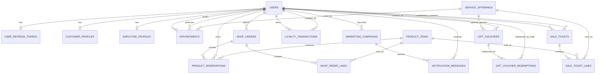

# ERD

```mermaid
erDiagram
    USERS ||--o| USER_REFRESH_TOKENS : has
    USERS ||--o| CUSTOMER_PROFILES : has
    USERS ||--o| EMPLOYEE_PROFILES : has

    USERS ||--o{ APPOINTMENTS : books
    USERS ||--o{ APPOINTMENTS : performs
    SERVICE_OFFERINGS ||--o{ APPOINTMENTS : used_by

    USERS ||--o{ SALE_TICKETS : creates
    USERS ||--o{ SALE_TICKETS : linked_customer
    SALE_TICKETS ||--o{ SALE_TICKET_LINES : contains
    PRODUCT_ITEMS ||--o{ SALE_TICKET_LINES : sold_as
    SERVICE_OFFERINGS ||--o{ SALE_TICKET_LINES : sold_as

    USERS ||--o{ LOYALTY_TRANSACTIONS : owns
    USERS ||--o{ LOYALTY_TRANSACTIONS : created_by

    USERS ||--o{ MARKETING_CAMPAIGNS : launches
    MARKETING_CAMPAIGNS ||--o{ NOTIFICATION_MESSAGES : queues
    USERS ||--o{ NOTIFICATION_MESSAGES : receives

    SERVICE_OFFERINGS ||--o{ GIFT_VOUCHERS : optional_service
    USERS ||--o{ GIFT_VOUCHERS : created_by
    GIFT_VOUCHERS ||--o{ GIFT_VOUCHER_REDEMPTIONS : redeemed_by
    USERS ||--o{ GIFT_VOUCHER_REDEMPTIONS : redeemed_by_staff

    USERS ||--o{ SHOP_ORDERS : places
    SHOP_ORDERS ||--o{ SHOP_ORDER_LINES : contains
    PRODUCT_ITEMS ||--o{ SHOP_ORDER_LINES : sold_as
    SHOP_ORDERS ||--o{ PRODUCT_RESERVATIONS : creates
    USERS ||--o{ PRODUCT_RESERVATIONS : owns
    PRODUCT_ITEMS ||--o{ PRODUCT_RESERVATIONS : reserves
```
