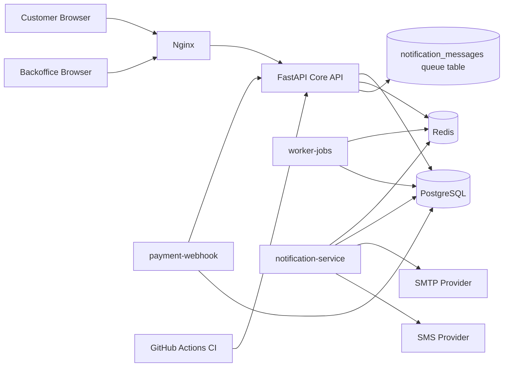

# Service Architecture

```mermaid
flowchart LR
    U[Customer Browser] --> N[Nginx]
    B[Backoffice Browser] --> N

    N --> API[FastAPI Core API]

    API --> PG[(PostgreSQL)]
    API --> R[(Redis)]

    API --> MQ[(notification_messages queue table)]

    W[worker-jobs] --> R
    W --> PG

    NS[notification-service] --> R
    NS --> PG
    NS --> SMTP[SMTP Provider]
    NS --> SMS[SMS Provider]

    PWH[payment-webhook] --> API
    PWH --> PG

    CI[GitHub Actions CI] --> API
```
