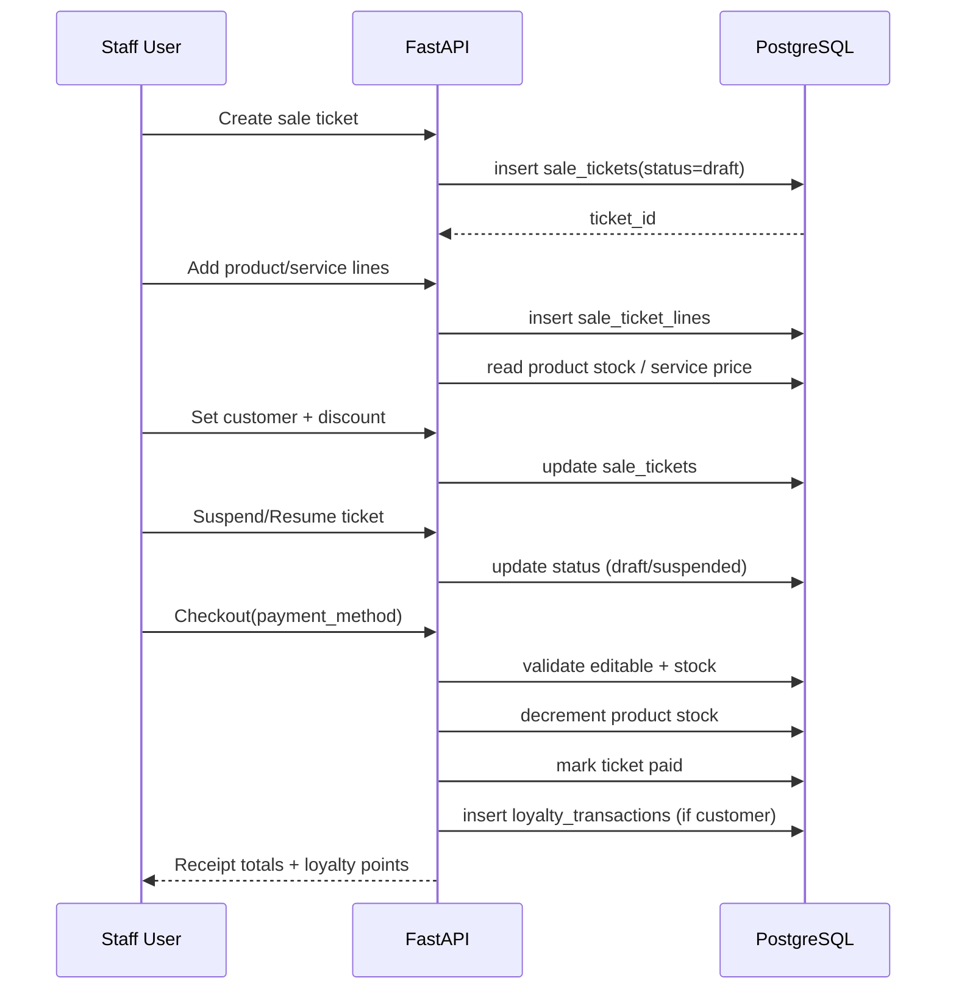

# POS Sequence

```mermaid
sequenceDiagram
    participant Staff as Staff User
    participant API as FastAPI
    participant DB as PostgreSQL

    Staff->>API: Create sale ticket
    API->>DB: insert sale_tickets(status=draft)
    DB-->>API: ticket_id

    Staff->>API: Add product/service lines
    API->>DB: insert sale_ticket_lines
    API->>DB: read product stock / service price

    Staff->>API: Set customer + discount
    API->>DB: update sale_tickets

    Staff->>API: Suspend/Resume ticket
    API->>DB: update status (draft/suspended)

    Staff->>API: Checkout(payment_method)
    API->>DB: validate editable + stock
    API->>DB: decrement product stock
    API->>DB: mark ticket paid
    API->>DB: insert loyalty_transactions (if customer)
    API-->>Staff: Receipt totals + loyalty points
```
