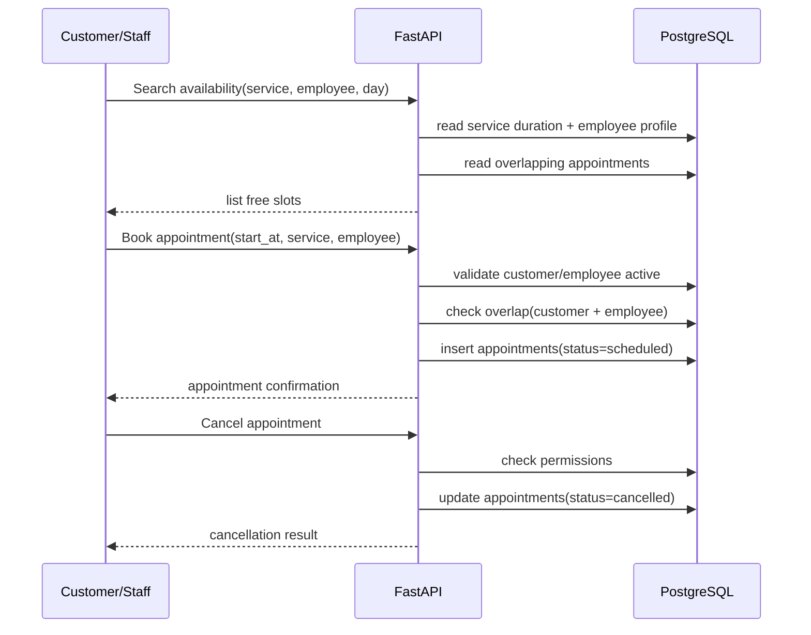

# Appointments Sequence

```mermaid
sequenceDiagram
    participant C as Customer/Staff
    participant API as FastAPI
    participant DB as PostgreSQL

    C->>API: Search availability(service, employee, day)
    API->>DB: read service duration + employee profile
    API->>DB: read overlapping appointments
    API-->>C: list free slots

    C->>API: Book appointment(start_at, service, employee)
    API->>DB: validate customer/employee active
    API->>DB: check overlap(customer + employee)
    API->>DB: insert appointments(status=scheduled)
    API-->>C: appointment confirmation

    C->>API: Cancel appointment
    API->>DB: check permissions
    API->>DB: update appointments(status=cancelled)
    API-->>C: cancellation result
```
