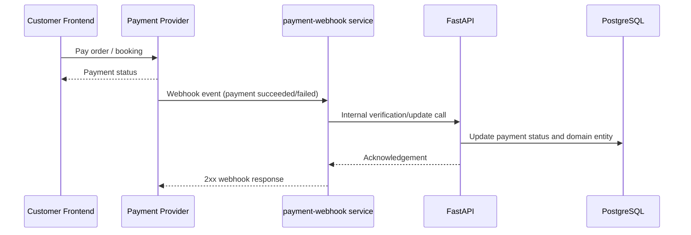

# Payment Webhook Sequence

```mermaid
sequenceDiagram
    participant Client as Customer Frontend
    participant PSP as Payment Provider
    participant WH as payment-webhook service
    participant API as FastAPI
    participant DB as PostgreSQL

    Client->>PSP: Pay order / booking
    PSP-->>Client: Payment status

    PSP->>WH: Webhook event (payment succeeded/failed)
    WH->>API: Internal verification/update call
    API->>DB: Update payment status and domain entity
    API-->>WH: Acknowledgement
    WH-->>PSP: 2xx webhook response
```
